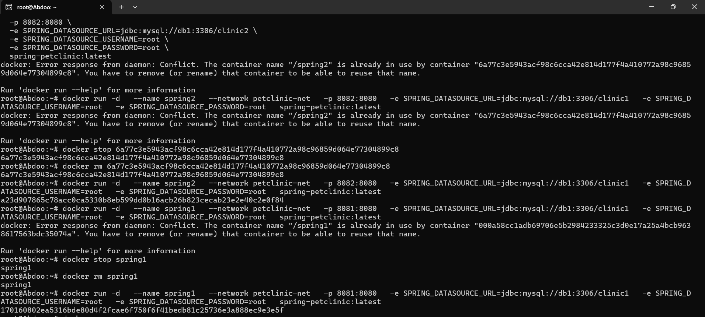

# docker-3

Docker Network Creation: The command docker network create petclinic-net successfully creates a new network named petclinic-net.
A container named spring1 and spring2 were started successfully, attached to the new network, and its internal port 8080 is mapped to the host's port 8081 and 8082.

we entered spring2 and made ifconfig 

  
I entered spring1 and ping on the spring2 ip to see the outcomes .
The ping worked 

  

The port 8081 worked for spring 1
  

The port 8082 worked for spring 2

  

Rerun spring1 and 2 with the all options 
  

  
  
  
  
  
  
  
  

