# docker-3

Docker Network Creation: The command docker network create petclinic-net successfully creates a new network named petclinic-net.
A container named spring1 and spring2 were started successfully, attached to the new network, and its internal port 8080 is mapped to the host's port 8081 and 8082.

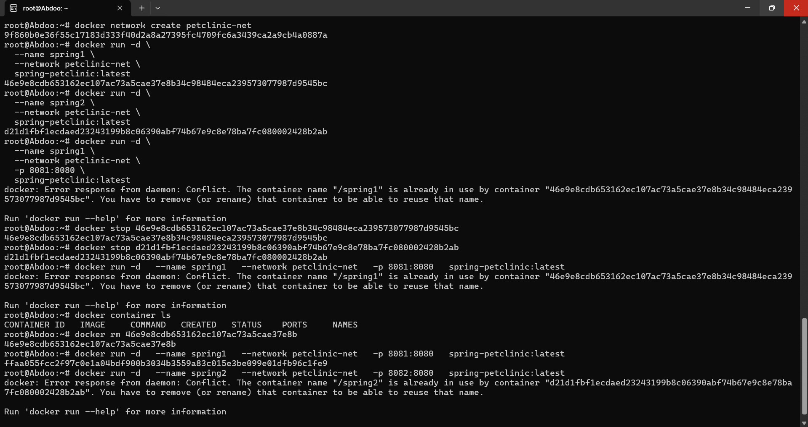

we entered spring2 and made ifconfig 

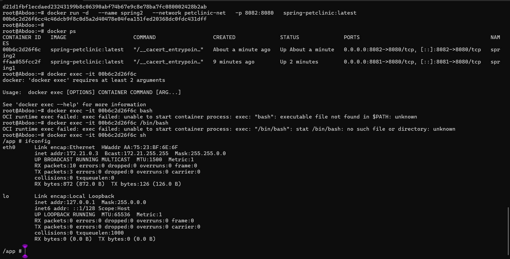  
I entered spring1 and ping on the spring2 ip to see the outcomes .
The ping worked 

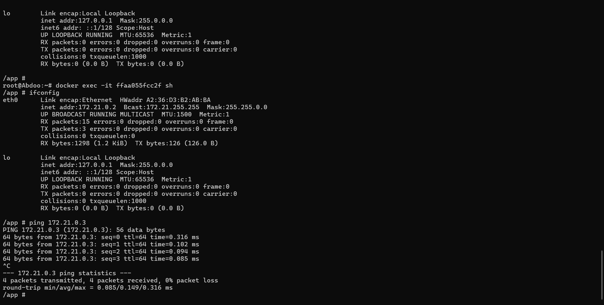  

The port 8081 worked for spring 1
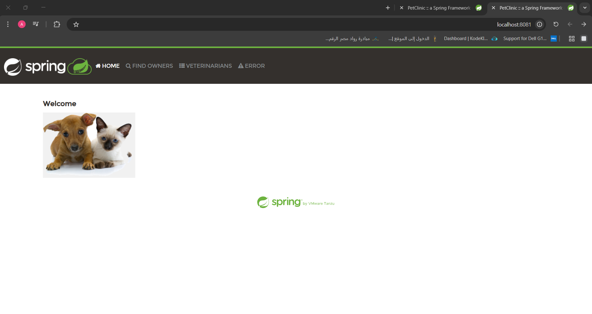  

The port 8082 worked for spring 2

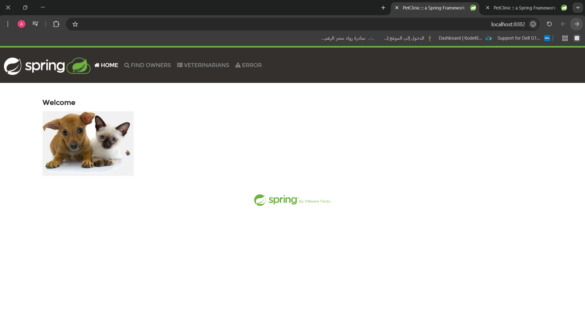  

Rerun spring1 and 2 with the all options in the petclinic-net network

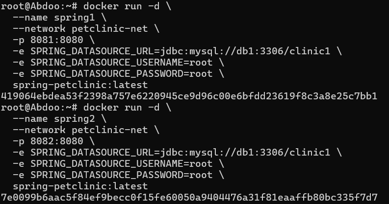  

Run the new db ==> db1 and db2 and they have the same volume 

Run docker ps 

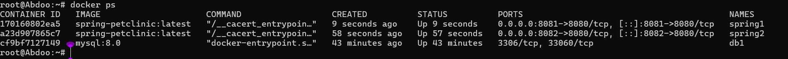  

Exec db1 
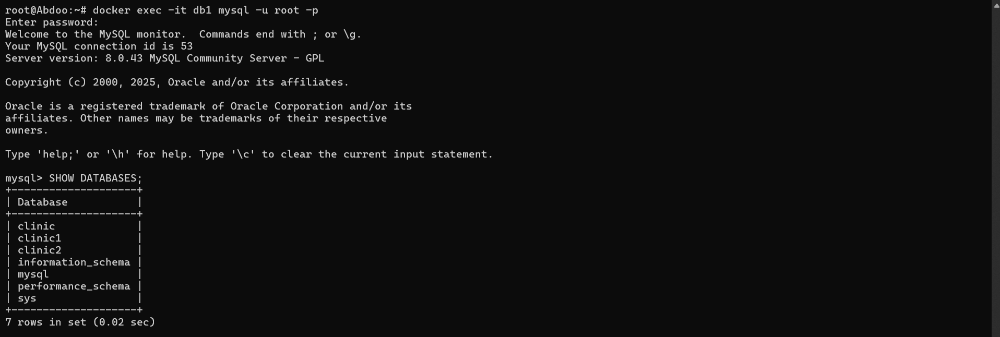 

Connect spring1 and spring2 with the db/clinic1 and clinc2 
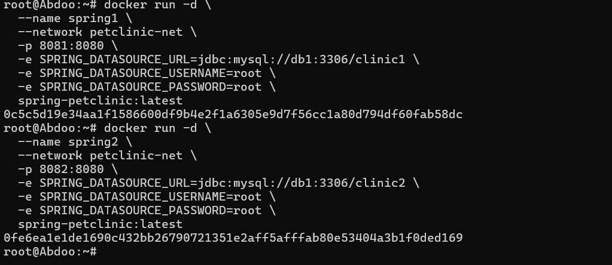  

Create spring3 which have anothe network AND anothe db ---> db3 and have 8083 port
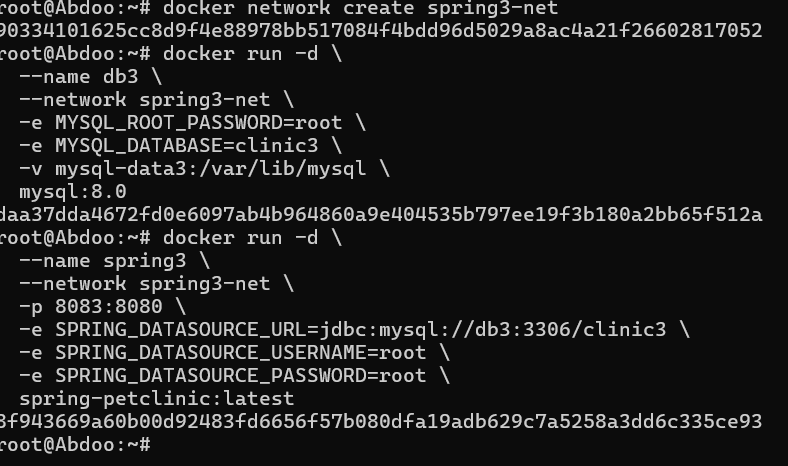  

Run docker ps
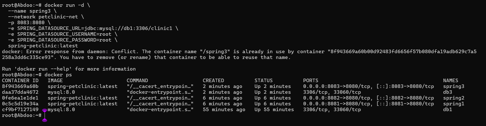  

Trying to connect spring3 with db1 and error happens
  

connect spring3 with the other network which has db1 and db2 inside it 
 

And connected sucessfully on port 8083
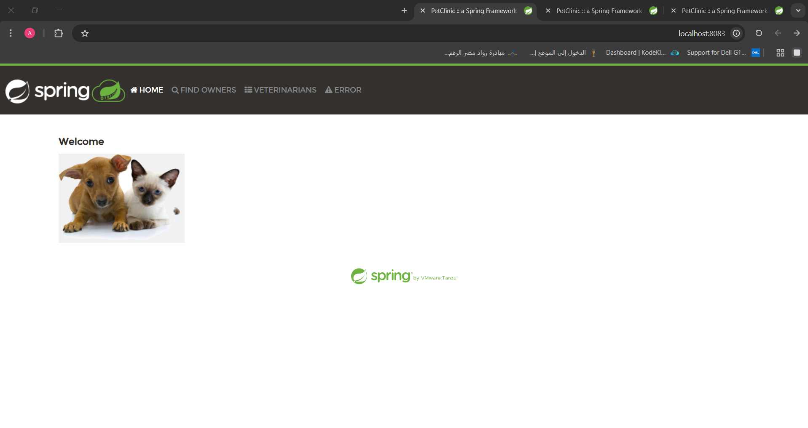

