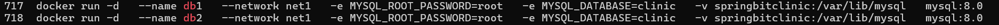

# docker-3
# Dockerized Spring Petclinic

This repository demonstrates how to run the **Spring Petclinic** application using **Docker**, setting up an isolated network for containers and connecting them to a database.

---

## 🚀 Steps and Command Explanations

### 1. Creating a Docker Network

The first step is to create a custom Docker network. This command creates a new, isolated network named `petclinic-net` that allows containers attached to it to communicate with each other using their container names as hostnames. This is a best practice for managing multi-container applications.

```bash
docker network create petclinic-net
```


---

### 2. Running the Application Containers

Next, two instances of the Spring Petclinic application are launched as Docker containers. The `docker run` command is used with several flags to configure each container.

```bash
# Running the spring1 container
docker run -d \
--name spring1 \
--network petclinic-net \
-p 8081:8080 \
-e SPRING_DATASOURCE_URL=jdbc:mysql://db1:3306/clinic1 \
-e SPRING_DATASOURCE_USERNAME=root \
-e SPRING_DATASOURCE_PASSWORD=root \
spring-petclinic:latest

# Running the spring2 container
docker run -d \
--name spring2 \
--network petclinic-net \
-p 8082:8080 \
-e SPRING_DATASOURCE_URL=jdbc:mysql://db1:3306/clinic1 \
-e SPRING_DATASOURCE_USERNAME=root \
-e SPRING_DATASOURCE_PASSWORD=root \
spring-petclinic:latest
```

- `docker run -d`: Runs the container in **detached mode** (`-d`), meaning it runs in the background and prints the container ID.  
- `--name`: Assigns a **human-readable name** to the container (`spring1` and `spring2`).  
- `--network`: Connects the container to the previously created **`petclinic-net` network**.  
- `-p 8081:8080` & `-p 8082:8080`: This is **port mapping**. It maps a port on the host machine (`8081` or `8082`) to the container's internal port (`8080`), allowing external access to the application.  
- `-e`: Sets **environment variables** (`-e`). These are crucial for configuring the application, such as the `SPRING_DATASOURCE_URL`, `USERNAME`, and `PASSWORD` needed to connect to a database.  
- `spring-petclinic:latest`: The name and tag of the **Docker image** to be used for the container.  


---

### 3. Verifying Inter-Container Communication

To prove that the containers can communicate with each other on the shared `petclinic-net`, a **ping test** was conducted.

1. First, `ifconfig` was run inside the `spring2` container (using `docker exec -it <container_id> sh`) to find its internal IP address.  
2. Then, from inside the `spring1` container, the `ping` command was used to test connectivity to the IP address of `spring2`.  

**Result:** The successful `ping` confirms that containers on the same Docker network can communicate with each other seamlessly, which is essential for a microservices architecture.  

  


---

### 4. Accessing the Applications

Finally, the running applications are accessed from a web browser using the host's IP address (or `localhost`) and the mapped port numbers.

- **Application 1:** `http://localhost:8081`  
- **Application 2:** `http://localhost:8082`  

**Result:** Both URLs correctly display the Spring Petclinic welcome page, proving that the applications are running and accessible.  

  


Run the new db ==> db1 and db2 and they have the same volume 



Run docker ps 

  

Exec db1 

 

Connect spring1 and spring2 with the db/clinic1 and clinc2 

  

Create spring3 which have anothe network AND anothe db ---> db3 and have 8083 port

  

Run docker ps

  

Trying to connect spring3 with db1 and error happens

  

connect spring3 with the other network which has db1 and db2 inside it 

 

And connected sucessfully on port 8083


