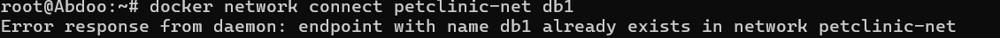

# docker-3
# Dockerized Spring Petclinic

This repository demonstrates how to run the **Spring Petclinic** application using **Docker**, setting up an isolated network for containers and connecting them to a database.

---

## 🚀 Steps and Command Explanations

### 1. Creating a Docker Network

The first step is to create a custom Docker network. This command creates a new, isolated network named `petclinic-net` that allows containers attached to it to communicate with each other using their container names as hostnames. This is a best practice for managing multi-container applications.

```bash
docker network create petclinic-net
```


---

### 2. Running the Application Containers

Next, two instances of the Spring Petclinic application are launched as Docker containers. The `docker run` command is used with several flags to configure each container.

```bash
# Running the spring1 container
docker run -d \
--name spring1 \
--network petclinic-net \
-p 8081:8080 \
-e SPRING_DATASOURCE_URL=jdbc:mysql://db1:3306/clinic1 \
-e SPRING_DATASOURCE_USERNAME=root \
-e SPRING_DATASOURCE_PASSWORD=root \
spring-petclinic:latest

# Running the spring2 container
docker run -d \
--name spring2 \
--network petclinic-net \
-p 8082:8080 \
-e SPRING_DATASOURCE_URL=jdbc:mysql://db1:3306/clinic1 \
-e SPRING_DATASOURCE_USERNAME=root \
-e SPRING_DATASOURCE_PASSWORD=root \
spring-petclinic:latest
```

- `docker run -d`: Runs the container in **detached mode** (`-d`), meaning it runs in the background and prints the container ID.  
- `--name`: Assigns a **human-readable name** to the container (`spring1` and `spring2`).  
- `--network`: Connects the container to the previously created **`petclinic-net` network**.  
- `-p 8081:8080` & `-p 8082:8080`: This is **port mapping**. It maps a port on the host machine (`8081` or `8082`) to the container's internal port (`8080`), allowing external access to the application.  
- `-e`: Sets **environment variables** (`-e`). These are crucial for configuring the application, such as the `SPRING_DATASOURCE_URL`, `USERNAME`, and `PASSWORD` needed to connect to a database.  
- `spring-petclinic:latest`: The name and tag of the **Docker image** to be used for the container.  


---

### 3. Verifying Inter-Container Communication

To prove that the containers can communicate with each other on the shared `petclinic-net`, a **ping test** was conducted.

1. First, `ifconfig` was run inside the `spring2` container (using `docker exec -it <container_id> sh`) to find its internal IP address.  
2. Then, from inside the `spring1` container, the `ping` command was used to test connectivity to the IP address of `spring2`.  

**Result:** The successful `ping` confirms that containers on the same Docker network can communicate with each other seamlessly, which is essential for a microservices architecture.  

  


---

### 4. Accessing the Applications

Finally, the running applications are accessed from a web browser using the host's IP address (or `localhost`) and the mapped port numbers.

- **Application 1:** `http://localhost:8081`  
- **Application 2:** `http://localhost:8082`  

**Result:** Both URLs correctly display the Spring Petclinic welcome page, proving that the applications are running and accessible.  

  


---

### 5. Running the Database Containers

The process begins by launching two separate MySQL database containers, named **`db1`** and **`db2`**. A **`docker run`** command is used for each, specifying their names, networks, and environment variables for the root password and initial database creation. The `-v` flag is also included to ensure data persistence by mounting a volume.

```bash
docker run -d \
--name db1 \
--network petclinic-net \
-e MYSQL_ROOT_PASSWORD=root \
-e MYSQL_DATABASE=clinic1 \
-v mysql-data1:/var/lib/mysql \
mysql:8.0

docker run -d \
--name db2 \
--network petclinic-net \
-e MYSQL_ROOT_PASSWORD=root \
-e MYSQL_DATABASE=clinic2 \
-v mysql-data2:/var/lib/mysql \
mysql:8.0
```

The image below shows a similar command for `db2` and another database container `db3` on a different network, demonstrating the consistency of the command structure.


---

### 6. Verifying Running Containers

The **`docker ps`** command is used to list all currently active containers. This is a vital step to confirm that both application containers (`spring1`, `spring2`) and at least one of the database containers (`db1`) are running as expected.


---

### 7. Connecting Application Containers to Databases

The `spring1` and `spring2` application containers are launched and configured to connect to their respective databases. The **`-e`** flag is used to pass environment variables that specify the database URL, username, and password. This is how the applications know where to find and how to connect to their databases.

- `spring1` connects to the `clinic1` database on the **`db1`** container.  
- `spring2` connects to the `clinic2` database on the **`db2`** container.  


---

### 8. Inspecting Databases from Inside a Container
To verify the database setup, you can use the **`docker exec`** command to run a command inside a running container. Here, `docker exec` is used to access the `db1` container and run the MySQL client. The `SHOW DATABASES;` command confirms that both the `clinic1` and `clinic2` databases have been successfully created, indicating that both applications are correctly connected and functional.


---

### 9. Running a New Application on an Isolated Network

This step showcases Docker's networking capabilities. A new network called **`spring3-net`** is created. A new database container, `db3`, and a new application container, `spring3`, are launched on this new network. The `spring3` container is also configured to use a new host port, **`8083`**. This demonstrates how to create completely isolated environments for different application instances.


The `docker ps` command is then run again to confirm that `spring3` and `db3` are now also running, alongside the previously launched containers.


---

### 10. Managing Container Network Connectivity

An attempt is made to connect the `db1` container to the `petclinic-net` using **`docker network connect`**. The command returns an error because `db1` is already connected to that network, highlighting that this command is used to add a container to a network, not to verify an existing connection.



The `docker network connect` command is then used correctly to add the **`spring3`** container to the **`petclinic-net`**. This is a crucial step that allows `spring3` to communicate with the `db1` and `db2` containers on that network.


---

### 11. Accessing the New Application

Finally, the new `spring3` application is accessed in a web browser using `http://localhost:8083`. This proves that the container is running, is correctly mapped to the host's port, and is accessible. The successful display of the Petclinic welcome page validates the entire setup, including the network and database connections.


